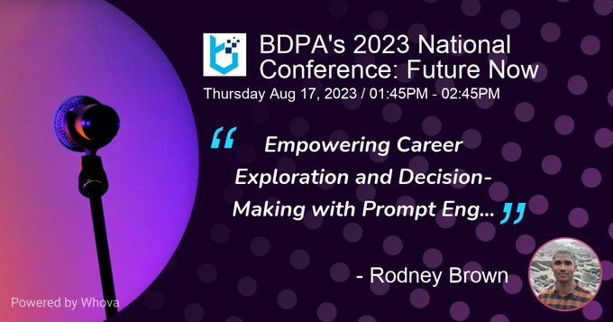

# JobTrendsPro



**Presented at the BDPA 2023 National Conference: Future Now** — *"Empowering Exploration and Decision-Making with Prompt Engineering"*

This project is a proof of concept built during the early adoption of ChatGPT, exploring how prompt engineering could address knowledge gaps in large language models. At the time, GPT 3.5 Turbo's training data cut off at 2021, leaving it unable to provide current job market statistics. Rather than waiting for model updates, this app demonstrated that carefully constructed prompts — enriched with real-time government data — could bridge that gap and deliver accurate, actionable career insights.

---

An AI-powered job exploration app that combines real Bureau of Labor Statistics (BLS) government data with OpenAI's GPT 3.5 Turbo to deliver career insights, wage breakdowns, and historical employment trends.

## Background

Built in 2022-2023, this app addressed a practical gap: ChatGPT's knowledge cutoff at the time was 2021, meaning it couldn't reliably answer questions about current job market data. JobTrendsPro solved this by feeding real BLS occupational statistics directly into GPT 3.5 Turbo prompts, giving users AI-driven career guidance grounded in actual government data.

## How It Works

Users walk through a multi-step wizard:

1. **Select a desired occupation** - Choose from 22 categories and hundreds of job titles
2. **Select your current occupation** - Same two-level category/title picker
3. **Set a desired salary** - Range from $20K to $250K
4. **Pick a target state** - All 50 US states
5. **Chat with AI** - The app fetches matching BLS data (employment numbers, wage percentiles, demand index), injects it into a prompt, and streams GPT's response with qualifications, education paths, networking tips, and resources

A historical employment chart (2013-2022) for the selected occupation category is also displayed using Chart.js.

## Tech Stack

- **Next.js 13** (App Router) + **React 18** + **TypeScript**
- **OpenAI GPT 3.5 Turbo** via `openai-edge` + Vercel AI SDK for streaming responses
- **Chart.js** / `react-chartjs-2` for historical trend visualization
- **Tailwind CSS** for styling
- **React Context API** for cross-component state management
- **pnpm** as the package manager

## Project Structure

```
app/
  api/chat/route.ts      # OpenAI streaming chat endpoint
  page.tsx               # Main page with multi-step wizard
  layout.tsx             # Root layout
components/
  Navbar.tsx             # App header
  HeroSection.tsx        # Landing hero
  VideoCarousel.tsx      # Auto-rotating video carousel
  About.tsx              # App description section
  DesiredOcc.tsx         # Desired occupation selector
  CurrentOcc.tsx         # Current occupation selector
  DesiredSalary.tsx      # Salary range picker
  DesiredState.tsx       # State selector
  CombinedData.tsx       # Shared context provider
  MainData.tsx           # Fetches and displays BLS statistics
  BLSChart.tsx           # Historical employment line chart
  OccTitleVars.tsx       # 22 arrays of occupation titles by category
  MapHistorical.tsx      # Maps subcategories to main chart categories
  Footer.tsx             # App footer
public/
  BLS_DATA/2021stats.json  # BLS occupational wage/employment data
  videos/                  # Hero section videos
```

## Data

The app uses a local JSON file (`public/BLS_DATA/2021stats.json`) containing BLS occupational employment and wage statistics. Each record includes:

- Total employment
- Mean, median, and percentile wages (10th, 25th, 75th, 90th) - both hourly and annual
- Job Demand Index
- Occupation group and title

Historical employment data (2013-2022) for 12 main occupation categories is embedded in `BLSChart.tsx` for trend charting.

## Getting Started

### Prerequisites

- Node.js 18+
- pnpm

### Setup

```bash
# Install dependencies
pnpm install

# Create environment file
cp .env.local.example .env.local
# Add your OpenAI API key to .env.local
```

### Environment Variables

| Variable | Description |
|----------|-------------|
| `OPENAI_API_KEY` | Your OpenAI API key |

### Run

```bash
# Development
pnpm dev

# Production build
pnpm build && pnpm start
```

## Occupation Categories

The app covers 22 BLS occupation groups including Architecture & Engineering, Arts & Design, Business & Financial, Computer & Mathematical, Healthcare, Legal, Management, Production, Sales, Transportation, and more.

## Deployment

Built for Vercel deployment out of the box. Set the `OPENAI_API_KEY` environment variable in your hosting platform's settings.
